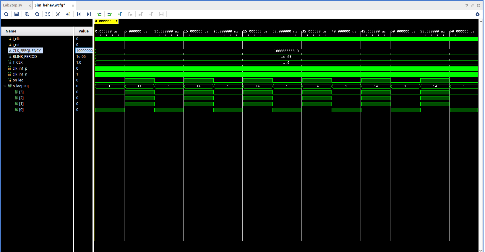
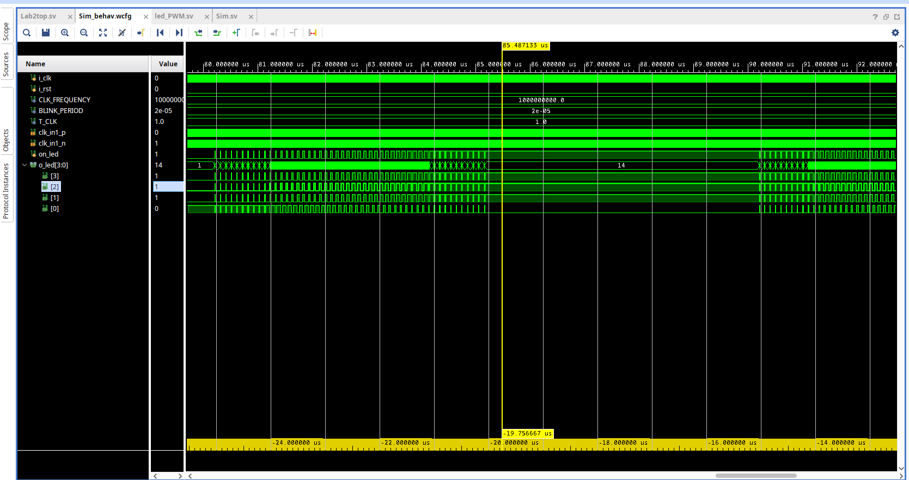

# Лабораторная работа №2

## Основное задание

## Индивидуальное задание

## Дополнительное задание

## Ответы на вопросы

### 1.6 Поясните следующую строку кода:

    constant COUNTER_WIDTH : positive := positive(ceil(log2(real(COUNTER_PERIOD +1))));

Данная строка служит для определения разрядности счетчика по его периоду: логарифм периода по основанию 2 возвращает степень двойки, необходимой для записи периода в двоичной системе счисления. Поскольку операция логарифма работает с типом real, далее происходит округление, приведение к положительному и запись в переменную типа positive - положительный подтип integer.

### 1.8 Как вы думаете, почему в приборах используют именно мигающие индикаторы, а не постоянно светящиеся?

На мой взгляд, мигающие индикаторы реализуют для того, чтобы пользователь видел, что устройство работает в каком-либо из своих режимов. Так же можно отметить, что мигающие индикаторы потребляют меньше энергии, чем постоянно светящиеся.

### 2.1 В чем отличия синтезируемого и несинтезируемого подмножеств языков описания?

Синтезируемая схема может быть преобразована в bitstream, загружена на ПЛИС и бужет корректно работать. Несинтезируемое описание схемы может быть использовано только в симуляции для тестирования т.к. содержит временные задержки и иные служебные конструкции.

### 3.3 Как изменится схема, если отключить сигнал i_rst от входа микросхемы?

Основной функционал схемы не поменяется, однако возможности сбросить таймер не будет.

### 3.4 Почему в симуляторе (в blink_led_tb) можно использовать тип real, а в описании модуля (blink_led) этот тип можно использовать только для вычисления констант?

Тип real, как и тип time является несинтезируемым, поэтому его можно использовать только в тестбенче и для вычисления констант.

### 3.5 Можно ли разделить значение счетчика counter_value на какое-нибудь число? Будет ли такое описание синтезировано? Будет ли синтезировано умножение counter_value на число?

Операции деления и умножения являются синтезируемыми, однако ими не стоит злоупотреблять в основном теле модуля т.к. для этого используются специальные модули.

### 4.2 На что влияет параметр тактовой частоты в файле ограничений timings.xdc? Что будет, если указать период ТЧ 1 нс?

Параметр частоты влияет на частоту тактирования всей схемы. При периоде 1 нс эта чатота тактирования составит 1ГГц.

### 4.3 Что определяет параметр IOSTANDARD в pinouts.xdc?

Этот параметр определяет стандарт питания входа/выхода. Так, например, LVCMOS33 означает напряжение логической единицы в 3,3В.

### 5.1 Что произойдет с платой и прошивкой, если выключить и включить питание? Как можно объяснить результат?

По умолчанию прошивка записывается в энергозависимую память, поэтому при отключении питания прошивка, записанная в плату стирается. При повторном включении питания выполнения программы не наблюдается.

### 5.2 Что такое JTAG? Зачем он необходим?

JTAG это специальный аппаратный интерфейс, разработанный по стандарту IEEE 1149.1. Используется для:
* выходного контроля микросхем при производстве
* тестирования собранных печатных плат
* прошивки микросхем с памятью
* отладочных работ при проектировании аппаратуры и программного обеспечения

### 6.1 Отличия always_ff и always_comb?

Always_ff описывает выполнение операций в flip-flop блоках (триггерах). always_comb служит для описания комбинаторной логики.

### 6.2 В чем разница между разными видами присвоения: а = с и a <= c?

Присвоения a = c блокирующие и выполняются последовательно. Присвоения a <= c неблокирующие и выполняются параллельно.

### 6.3 Поясните, за что отвечает фрагмент кода:

    а) reg [COUNTER_WIDTH -1 : 0] counter_value = '0;
Заполнение всех битов регистра counter_value нулями.

    б) always_ff @(posedge i_clk) begin
Начало блока always_ff для работы с триггерами, чуствительного к фронтам сигнала i_clk

    в) assign o_led = {0:(~i_rstn | led_on), default:(~i_rstn | ~led_on)} ;
Запись результата лог. выражения (~i_rstn | led_on) в нулевой бит регистра o_led и запись результата лог.выражения (~i_rstn | ~led_on) в оставшиеся биты регистра. В результате, получается следующая таблица истинности:

i_rstn|  led_on | o_led |
------|---------|-------|
0     |0        |0b1111 |
0     |1        |0b1111 |
1     |0        |0b1110 |
1     |1        |0b0001 |

    г) localparam COUNTER_WIDTH = int($ceil($clog2(COUNTER_PERIOD +1)));
см. 1.6

    д) always #(T_CLK/2) i_clk = ~i_clk;
Инверсия сигнала i_clk каждые пол периода T_CLK

    е) 	initial begin
    i_rstn = 1'b1;
    #10e3 i_rstn = 1'b0;
    #(20*T_CLK) i_rstn = 1'b1;
    end
Единоразово сгенерировать понижение лог. уровня с 1 до 0 через 10e3 шагов, подождать 20*T_CLK шагов и обратно установить 1.

### 6.4 Отличия двух деклараций сигналов:
    reg [COUNTER_WIDTH -1 : 0] counter_value = '0;
<!---------------------->
    wire [COUNTER_WIDTH -1 : 0] counter_value = '0;

Reg может хранить и передовать информацию, когда как wire может её только передавать.
